# PulseVortex: Trade Setup Analyzer & Monitor

[](https://github.com/firetee13/trader/actions/workflows/ci.yml)
[](https://github.com/firetee13/trader/actions/workflows/code-quality.yml)
[](https://github.com/firetee13/trader/actions/workflows/issue-automation.yml)
[](https://github.com/firetee13/trader/actions/workflows/dependabot/dependabot-updates)
[](https://github.com/firetee13/PulseVortex/actions/workflows/scheduled.yml)
[](https://github.com/firetee13/monitor#testing)
[](https://www.python.org/downloads/)
[](https://github.com/psf/black)
[](https://github.com/pycqa/flake8)
[](https://opensource.org/licenses/MIT)

A comprehensive Python application suite for automated trade setup detection and monitoring via MetaTrader 5 (MT5) integration. Designed for forex, crypto, and indices traders, it provides CLI tools for analysis and hit detection, plus a GUI for visualization, SL proximity optimization, and PnL analytics.

Key Components:
- **CLI Setup Analyzer** (`monitor-setup`): Analyzes MT5 symbols to identify high-confidence trade setups based on multi-timeframe strength, ATR volatility, pivot S/R levels, and spread/volume filters
- **PulseVortex GUI Monitor** (`monitor-gui`): Visual interface for real-time monitoring, database results viewing, SL proximity stats, and PnL analytics with interactive charts
- **TP/SL Hit Checker** (`monitor-hits`): Monitors take-profit and stop-loss hits using MT5 ticks, with bar prefiltering and quiet-hour awareness

Supports automated setup detection, real-time TP/SL hit monitoring, database persistence, and advanced analytics including SL proximity optimization and ATR-normalized PnL visualization.

## Table of Contents

- [Features](#features)
- [Requirements](#requirements)
- [Installation](#installation)
- [Quick Start](#quick-start)
- [GUI Interface](#gui-interface)
- [CLI Tools](#cli-tools)
- [Configuration](#configuration)
- [Database Schema](#database-schema)
- [Testing](#testing)
- [Architecture](#architecture)
- [Troubleshooting](#troubleshooting)
- [Contributing](#contributing)

## Features

### Core Analysis Engine

- **Real-time MT5 Integration**: Connects to MetaTrader 5 for live tick data, rates, and symbol info with caching for efficiency
- **Multi-Timeframe Strength Consensus**: Computes directional strength from 1H/4H/1D close changes; requires majority agreement (≥2/3 timeframes aligned) with 4H as tiebreaker
- **ATR(14) Volatility Normalization**: D1 ATR for risk sizing and bonus scoring when ATR% in [60,150]; used for PnL normalization in GUI
- **Pivot Point S/R Levels**: Previous D1 high/low/close for S1/R1 pivots; fallbacks to D1 extremes if pivots unavailable
- **Live Bid/Ask Precision**: Entry at Ask (Buy)/Bid (Sell); SL/TP distances validated against 10x spread minimum for execution realism

### Advanced Filtering System

- **Spread Classification & Filter**: Rejects "Avoid" spreads (>0.3%); classifies as Excellent(<0.1%), Good(0.1-0.2%), Acceptable(0.2-0.3%)
- **Tick Freshness Check**: Requires recent tick (≤60s old) to confirm market activity; skips closed symbols
- **SL/TP Distance Guards**: SL ≥10x spread from trigger side (Bid for Buy SL, Ask for Sell SL); same for TP from entry side
- **Proximity-to-SL Binning**: Tracks entry position within SL-TP range (0.0=at SL, 1.0=at TP); GUI analyzes sweet spots (e.g., 0.3-0.4 often optimal)
- **Quiet Hours Exclusion**: Skips analysis during 23:45-00:59 UTC+3 (forex/indices) or weekends (crypto); configurable via `monitor/quiet_hours.py`

### Risk Management

- **Risk-Reward Ratio (RRR)**: No minimum filter (post-analysis sorting); computed as reward/risk where reward=TP-entry, risk=entry-SL
- **Stop-Loss Logic**:
  - Buy: SL = min(S1, D1 Low) ensuring SL < entry
  - Sell: SL = max(R1, D1 High) ensuring SL > entry
- **Take-Profit Logic**:
  - Buy: TP = max(R1, D1 High) ensuring TP > entry
  - Sell: TP = min(S1, D1 Low) ensuring TP < entry
- **Entry Validation**: Price must be between SL/TP; rejects invalid orientations (e.g., Buy with entry > TP)

### Momentum Context

- **Timelapse Momentum**: Compares current vs. prior snapshot (D1 close delta, 4H strength change); +1.0 score for aligned D1 trend, +0.8 for 4H momentum
- **Composite Scoring**: Base = aligned strength timeframe count * 1.5; +0.5 for ATR% in range; spread class bonuses (-2 to +1); -0.4 penalty for late entries (prox >0.65)

### Operational Modes

- **Single Run**: One-time analysis of visible MT5 symbols or `--symbols "EURUSD,GBPUSD"`
- **Watch Mode**: Continuous polling (`--watch --interval 2.0`); defaults to 1s, honors quiet hours
- **Symbol Targeting**: Defaults to MarketWatch visibles; `--symbols` for list, `--exclude` for filtering (e.g., "GLMUSD,BCHUSD")
- **Deduplication**: Skips symbols with open setups in same proximity bin (0.1 buckets) to avoid over-trading

### GUI Interface Features

- **Monitors Tab**: Start/stop CLI tools (`monitor-setup --watch`, `monitor-hits --watch`); live dual-pane logs; exclude symbols input
- **DB Results Tab**: Table of setups/hits with filters (time, category, status, symbol); delete selected; auto-refresh; 1m candlestick charts with SL/TP overlays (pauses in quiet hours)
- **SL Proximity Tab**: Analyzes entry position within SL-TP range; sweet-spot bins (e.g., 0.3-0.4 often >0.2R expectancy); per-symbol/category stats; auto-refresh
- **PnL Tab**: Cumulative/average charts by category (Forex/Crypto/Indices) at 10k notional; win/loss markers; time-range filter; positive expectancy filtering for proximity bins
- **PnL (Normalized) Tab**: ATR-normalized returns (risk units, log equity, vol-target, notional); category/bin filters; interactive metric switching; expectancy metrics displayed in R (risk units)
- **Persistence**: Settings saved to `monitor_gui_settings.json` (excludes, filters, intervals); quiet-hour aware (pauses charts/monitors 23:45-00:59 UTC+3)

### TP/SL Hit Monitoring

- **Tick-Based Detection**: Scans ticks since last check; Buy SL on Bid≤SL, TP on Bid≥TP; Sell SL on Ask≥SL, TP on Ask≤TP
- **Bar Prefiltering**: M1 bars to identify candidate windows (bars crossing SL/TP ± spread guard); fetches ticks only for those (~200ms poll)
- **Quiet-Hour Awareness**: Pauses monitoring 23:45-00:59 UTC+3 (forex/indices) or weekends (crypto); resumes automatically
- **Deduplication & State**: Tracks last-checked per setup; ignores hits ≤ entry time or in quiet windows; persists state in DB

### Data Persistence

- **SQLite Schema**: `timelapse_setups` (id, symbol, direction, price, sl, tp, rrr, score, as_of, detected_at, proximity_to_sl, proximity_bin, inserted_at); `timelapse_hits` (setup_id, hit, hit_price/time, entry_price/time)
- **Deduplication**: ON CONFLICT DO NOTHING on (symbol, direction, as_of); open-setup gating by proximity bin
- **GUI Analytics**: Queries for PnL (hits only), proximity stats (bins 0.1-wide), normalized returns (ATR/vol)

### Performance Optimizations

- **MT5 Rate Caching**: TTL per timeframe (W1:120s, D1/H4:45s, H1:12s, M15:6s); reduces IPC calls
- **Tick Fetching**: Chunked by minute (default 1440min/page); prefiltered via M1 bars crossing SL/TP
- **Database Performance**: Enhanced connection timeout (12s) and indexing on `timelapse_setups` and `timelapse_hits` tables for faster queries; lazy connections with managed close

## Requirements

### Software Dependencies

- **Python 3.8+** (tested 3.10-3.12)
- **MetaTrader 5 Terminal**: Installed and running; symbols in MarketWatch
- **SQLite3**: Built-in with Python stdlib

### Python Packages

- `MetaTrader5>=5.0.45` (MT5 Python API)
- `matplotlib>=3.5.0` (GUI charts, candlesticks, PnL analytics)
- `numpy>=1.21.0` (ATR calculations, array ops)

### System Requirements

- **Windows 10/11** (primary; MT5 Python API compatibility)
- **4GB+ RAM** (for 100+ symbols, charts, MT5 terminal)
- **Stable internet** (MT5 data streaming; GUI local only)
- **Tkinter** (included in most Python installs; `pip install tk` if missing)

## Installation

1. **Clone/Download** repository to `c:/PulseVortex` (or your workspace)
2. **Install Dependencies**:
   ```bash
   # Install the package in editable mode with development dependencies
   pip install -e .

   # Or install only runtime dependencies
   pip install -r requirements.txt
   ```
   (MetaTrader5, matplotlib, numpy; package creates CLI entry points)
3. **Install/Run MT5 Terminal**: Ensure `terminal64.exe` is accessible (set `MT5_TERMINAL_PATH` env if non-standard)
4. **Configure MT5**: Add symbols (e.g., EURUSD, BTCUSD) to MarketWatch; enable tick history
5. **GUI Setup**: Tkinter auto-included; test with `python -c "import tkinter"`

## Quick Start

### Basic Analysis (CLI)

```bash
# Single analysis of visible MarketWatch symbols
monitor-setup

# Target specific symbols (comma-separated)
monitor-setup --symbols "EURUSD,GBPUSD,BTCUSD"

# Continuous watch (1s default; honors quiet hours)
monitor-setup --watch --interval 2.0 --exclude "GLMUSD,BCHUSD"

# Debug filtering/spreads
monitor-setup --debug --brief
```

### Example Output

```
EURUSD | Buy @ 1.0850 (Ask) | SL 1.0820 (S1) | TP 1.0920 (R1) | RRR 2.33 | score 3.2
  -> Consensus: 1H/4H/1D (2/3); Strength 1H/4H/1D: +2.1/+1.8/+0.9; ATR: 15.2 pips (1.40%, bonus); Prox: 0.32 (near support); Timelapse: D1 up 0.0032 (+1.0), 4H momentum +0.8; Spread: 0.08% (Excellent +1.0)
[DB] Inserted 1 new setup(s): EURUSD | tick time 14:23:45 UTC+3 | bid 1.0849 | ask 1.0850
```

### TP/SL Monitoring (CLI)

```bash
# Single check of recent setups (last 24h)
monitor-hits --since-hours 24

# Target specific setups/ symbols
monitor-hits --ids 1,2,3 --verbose
monitor-hits --symbols "EURUSD,BTCUSD" --max-mins 60

# Continuous watch (1s default; auto-pauses quiet hours)
monitor-hits --watch --interval 1 --bar-timeframe M1 --tick-padding 1.0
```

### Example Output

```
[NO HIT] #123 EURUSD Buy | window 45.2 mins | ticks 1,234 | pages 2 | fetch=45ms scan=12ms thr=102k avg_pg=617
[HIT TIMING] #124 BTCUSD Sell | windows 3 | ticks 567 | pages 1 | fetch=23ms scan=4ms | TP hit at 2025-10-06 14:23:45 UTC+3
[DB] Recorded TP hit for setup #124 BTCUSD Sell | entry 65,200 | hit_price 64,800 | rrr 2.1
Checked 15 setup(s); hits recorded: 2. BTCUSD EURUSD
```

## GUI Interface

### Launching the GUI

**Windows (Recommended)**:
```batch
# First install the package
pip install -e .

# Then launch via VBS
cscript Run_Monitors.vbs
```
(Launches minimized; right-click tray icon to restore)

**Direct Launch**:
```bash
monitor-gui
# Or with log restore (if restarting):
monitor-gui --restore-timelapse-log /path/to/timelapse.log --restore-hits-log /path/to/hits.log
```

**Debug Mode**:
```bash
python -m monitor.gui.main
```
(Visible console for errors; use for troubleshooting)

### GUI Workflow

1. Launch GUI (minimized via VBS or direct)
2. **Monitors Tab**: Set exclude symbols (e.g., "GLMUSD,BCHUSD"); click Start for both tools (auto-restarts on crash)
3. **DB Results**: Filter by time/category/status/symbol; select row for 1m chart with SL/TP (pauses in quiet hours)
4. **SL Proximity**: Auto-computes sweet spots (e.g., 0.3-0.4 bin often >50% TP, +0.2R expectancy); per-category leaders
5. **PnL Tabs**: 10k-notional cumulative by category; normalized (ATR/risk/vol/notional) with bin filters
6. **Restart**: "Restart" button relaunches GUI preserving logs; settings persist across sessions

### GUI Settings

- **Persistent**: Excludes, filters, intervals saved to `monitor_gui_settings.json`
- **Quiet Hours**: Charts pause 23:45-00:59 UTC+3 (forex/indices) or weekends (crypto); hits monitor auto-pauses/resumes
- **Charts**: Matplotlib candlesticks (M1 bars or ticks); SL/TP lines; entry arrow; hit markers; timezone UTC+3 display

## CLI Tools

### Setup Analyzer (`monitor-setup`)

```bash
monitor-setup [OPTIONS]
```

#### Usage Options
- `--symbols SYMBOLS`: Target list (default: MarketWatch visibles)
- `--exclude SYMBOLS`: Skip list (e.g., `--exclude "GLMUSD,BCHUSD"`)
- `--watch`: Continuous mode (default interval 1s; `--interval 2.0`)
- `--debug`: Diagnostics (filter reasons, spread calcs, tick ages)
- `--brief`: Compact output (no JSON details)

#### Output Control
- `--top N`: Limit to top N setups by score/RRR (post-filter)

### TP/SL Hit Checker (`monitor-hits`)

```bash
monitor-hits [OPTIONS]
```

#### Usage Options
- `--since-hours HOURS`: Last N hours of setups (default: all)
- `--ids IDS`: Specific setup IDs (e.g., `--ids 1,2,3`)
- `--symbols SYMBOLS`: Filter by symbols (e.g., `--symbols "BTCUSD,SOLUSD"`)
- `--watch`: Continuous (default 1s; `--interval 5`)
- `--max-mins MINS`: Tick chunk size (default 1440min; smaller for perf)
- `--bar-timeframe TF`: Prefilter bars (default M1; e.g., M5 for less noise)
- `--bar-backtrack MINS`: Bar history buffer (default 2min before as_of)
- `--tick-padding SECS`: Extra seconds around candidate windows (default 1.0)
- `--dry-run`: Test without DB writes
- `--verbose`: Timings/pages/ticks per setup

#### Detection Logic
- **Prefilter**: M1 bars crossing SL/TP ±1.5x spread; fetches ticks only for candidates
- **Trigger Prices**: Buy (Bid≤SL, Bid≥TP); Sell (Ask≥SL, Ask≤TP)
- **Quiet Awareness**: Ignores hits in 23:45-00:59 UTC+3 (forex/indices) or weekends (crypto)
- **State Tracking**: Per-setup last-checked timestamp; resumes from there on restart
- **Server Offset**: Auto-detects broker timezone (±hours) for accurate tick alignment

## Configuration

### Database (`timelapse.db`)
- **Path**: Resolved via `monitor/config.py` (default `./timelapse.db`; env `TIMELAPSE_DB_PATH`)
- **Auto-Migration**: Adds columns (e.g., `proximity_bin`, `detected_at`) on startup
- **Backup**: Manual via SQLite tools; GUI shows recent setups/hits only
- **Schema**: See [Database Schema](#database-schema) below

### MT5 Terminal
- **Setup**: Run MT5; add symbols to MarketWatch (View > Market Watch > right-click > Show All)
- **Permissions**: Allow DLL imports (Tools > Options > Expert Advisors); enable Algo Trading if needed
- **Path Override**: Set `MT5_TERMINAL_PATH` env for non-standard installs (e.g., portable)
- **Timeout/Retries**: Defaults 90s/2 retries; increase via `--mt5-timeout 120 --mt5-retries 3` in CLI

### Environment Variables
- `TIMELAPSE_DB_PATH`: Custom DB location (default `./timelapse.db`)
- `TIMELAPSE_SPREAD_MULT`: SL/TP distance multiplier (default 10x spread)
- `MT5_TERMINAL_PATH`: Path to `terminal64.exe` (e.g., `C:/Users/You/AppData/Roaming/MetaQuotes/...`)
- `MT5_TIMEOUT`: MT5 init timeout (default 90s)
- `MT5_RETRIES`: Init retries (default 2)
- `MT5_PORTABLE`: Set to 1 for portable MT5 mode

## Database Schema

### `timelapse_setups` Table

| Column | Type | Description |
|--------|------|-------------|
| id | INTEGER PRIMARY KEY AUTOINCREMENT | Unique setup ID |
| symbol | TEXT NOT NULL | e.g., "EURUSD", "BTCUSD" |
| direction | TEXT NOT NULL | "Buy" or "Sell" |
| price | REAL | Entry price (Ask for Buy, Bid for Sell) |
| sl | REAL | Stop-loss level (S1/D1 Low for Buy; R1/D1 High for Sell) |
| tp | REAL | Take-profit level (R1/D1 High for Buy; S1/D1 Low for Sell) |
| rrr | REAL | Reward/risk ratio (TP-entry)/(entry-SL) |
| score | REAL | Composite score (strength alignment + ATR bonus + spread + momentum - late penalty) |
| as_of | TEXT NOT NULL | Analysis timestamp (UTC naive ISO) |
| detected_at | TEXT | Detection time (UTC+3 ISO; optional) |
| proximity_to_sl | REAL | Entry position in SL-TP range (0.0=at SL, 1.0=at TP) |
| proximity_bin | TEXT | Binned prox (e.g., "0.3-0.4") for dedup/gating |
| inserted_at | TEXT NOT NULL DEFAULT CURRENT_TIMESTAMP | DB insertion time |

### `timelapse_hits` Table

| Column | Type | Description |
|--------|------|-------------|
| id | INTEGER PRIMARY KEY AUTOINCREMENT | Hit record ID |
| setup_id | INTEGER UNIQUE | References timelapse_setups.id (CASCADE delete) |
| symbol | TEXT NOT NULL | Copied from setup |
| direction | TEXT NOT NULL | "Buy" or "Sell" |
| sl | REAL | Copied from setup |
| tp | REAL | Copied from setup |
| hit | TEXT NOT NULL CHECK (TP,SL) | "TP" or "SL" |
| hit_price | REAL | Actual trigger price (Bid/Ask based on side) |
| hit_time | TEXT NOT NULL | Hit timestamp (UTC naive ISO) |
| hit_time_utc3 | TEXT | Display time (UTC+3 ISO) |
| entry_time_utc3 | TEXT | Setup insertion (UTC+3 ISO) |
| entry_price | REAL | Copied from setup/hit |
| checked_at | TEXT NOT NULL DEFAULT CURRENT_TIMESTAMP | Scan completion time |

### Indexes & Optimizations
- `timelapse_hits`: INDEX on (symbol), (setup_id)
- `timelapse_setups`: UNIQUE(symbol, direction, as_of); gating via LEFT JOIN hits

## Testing

### Unit Tests
Run via `unittest` (≥90% coverage target; MT5 fakes for isolation):
```bash
python -m unittest discover -s tests -p "test_*.py" -v
```
- `tests/test_timelapse_setups.py`: Strength, pivots, ATR, filtering, scoring (tests CLI setup analyzer)
- `tests/test_check_tp_sl_hits.py`: Tick scanning, bar prefilter, quiet hours (tests CLI hit checker)
- `tests/test_mt5_client.py`: Caching, offsets, symbol resolution
- `tests/test_quiet_hours.py`: Timezone logic, ranges
- `tests/test_tp_sl_state.py`: DB state persistence
- `tests/test_config.py`: Environment variable handling, DB path resolution
- `tests/test_db_helpers.py`: Database helper functions, hit recording, setup loading
- `tests/test_symbols.py`: Symbol classification, category detection

Add tests for new features; use fakes for MT5/SQLite (no live terminal needed).

## Architecture

### Core Modules (`src/monitor/`)

- **`cli/`**: Command-line interface modules
  - `setup_analyzer.py`: Setup analysis and scoring logic
  - `hit_checker.py`: TP/SL hit detection and monitoring
- **`gui/`**: Graphical user interface
  - `main.py`: Tkinter-based GUI with multiple tabs
- **`core/`**: Core business logic and utilities
  - `mt5_client.py`: MT5 wrapper; init/shutdown, symbol resolve, rates/ticks with caching (TTL per TF), server offset detection
  - `config.py`: DB path resolution (`TIMELAPSE_DB_PATH`), env defaults
  - `db.py`: SQLite helpers; table creation, inserts with gating/dedup, hit recording
  - `domain.py`: Dataclasses (Setup, Hit, TickFetchStats); no business logic
  - `quiet_hours.py`: Timezone-aware ranges (UTC+3 quiet 23:45-00:59; crypto weekends); iter_active/quiet
  - `symbols.py`: Heuristic classification (forex/currency pairs, crypto/*USD, indices like NAS100)

### Data Flow

1. **Symbol Discovery**: MT5 MarketWatch visibles (or `--symbols`)
2. **Data Fetch**: Cached rates (D1/H4/W1/H1/M15); live Bid/Ask/tick time; pivots from prev D1
3. **Analysis**: Strength deltas, multi-timeframe alignment (2/3 TFs), S/R SL/TP, RRR/prox, filters (spread/tick/quiet/distance)
4. **Scoring & Filter**: Composite score; reject invalid/no-alignment/low-spread; dedup open setups by bin
5. **DB Insert**: Gated by open status/prox bin; proximity_bin for stats
6. **Monitoring**: `monitor-hits` polls active setups; bar-prefilter → tick scan → hit record
7. **GUI**: Tabs query DB for results/prox/PnL; MT5 for charts; auto-pause quiet hours

## Troubleshooting
## Architecture Diagram

```mermaid
graph TD
    subgraph External ["External Dependencies"]
        MT5([🔌 MT5 Terminal<br/>Live market data])
    end

    subgraph EntryPoints ["Entry Points & Configuration"]
        direction TB
        VBS[🚀 Run_Monitors.vbs<br/>Windows launcher]
          REQ[📋 requirements.txt<br/>Dependencies]
    end

    subgraph Core ["Core Modules monitor/"]
        direction TB
        MC{{📡 mt5_client.py<br/>MT5 wrapper, caching,<br/>ticks/rates/ATR}}
        DB[(💾 db.py<br/>SQLite ops, schema,<br/>inserts/queries)]
        QH{⏰ quiet_hours.py<br/>Timezone-aware pauses/<br/>quiet hour filtering}
        SY[🏷️ symbols.py<br/>Classification: forex/<br/>crypto/indices]
        CF[⚙️ config.py<br/>DB path, env vars,<br/>settings resolution]
        DM[/📋 domain.py<br/>Dataclasses: Setup,<br/>Hit, TickFetchStats/]
    end

    subgraph CLI ["CLI Tools"]
        direction TB
        TS{{🔍 monitor-setup<br/>Setup analysis, scoring,<br/>multi-TF alignment}}
        CH[🎯 monitor-hits<br/>TP/SL hit detection,<br/>tick scanning + filtering]
    end

    subgraph GUISub ["GUI Interface"]
        MG([📊 monitor-gui<br/>Tabs: Monitors, DB Results,<br/>SL Proximity, PnL<br/>+ Expectancy Filtering])
    end

    subgraph Testing ["Test Suite"]
        direction TB
        TESTS[[🧪 tests/<br/>Unit tests<br/>90%+ coverage<br/>MT5 fakes for isolation]]
    end

    subgraph Persist ["Persistence Layer"]
        direction TB
        TIMELAPSE[(📁 timelapse.db<br/>Setups & Hits tables<br/>+ Indexes for performance)]
        SETTINGS[⚡ monitor_gui_settings.json<br/>UI prefs, excludes,<br/>filters, intervals]
    end

    %% Entry Points connections
    VBS -->|"Launches minimized"| MG
    REQ -.->|"Dependency management"| Core

    %% MT5 data flows
    MT5 -.->|"Live data: ticks, rates, symbols<br/>ATR calculations, timeframes"| MC
    MC -->|"Cached rates (W1/D1/H4/H1/M15)"| TS
    MC -->|"Real-time ticks/bars<br/>Server offset detection"| CH
    MC -.->|"Historical data for charts<br/>Live price updates"| MG

    %% Analysis flows
    TS -->|"Setup records (score, RRR, prox)"| DB
    CH -->|"Hit records (TP/SL detection)"| DB
    DB <-->|"CRUD ops with indexes<br/>12s timeout optimization"| TIMELAPSE
    TIMELAPSE -->|"Queries: results, stats, PnL<br/>Proximity bin analysis"| MG

    %% Quiet hours integration
    QH -.->|"Pause during quiet hours<br/>23:45-00:59 UTC+3"| TS
    QH -.->|"Suspend monitoring<br/>Auto-resume after quiet"| CH
    QH -.->|"Chart pauses<br/>Weekend crypto handling"| MG

    %% Symbol classification flows
    SY -.->|"Symbol filtering & categorization<br/>Forex/Crypto/Indices"| TS
    SY -.->|"Category-based statistics<br/>Per-symbol analytics"| CH
    SY -.->|"Per-symbol views & filtering<br/>Category-based PnL"| MG

    %% Configuration and data models
    CF -->|"Environment variables<br/>DB path resolution"| DB
    DM -->|"Setup/Hit data structures<br/>Validation models"| TS
    DM -->|"Hit detection structs<br/>State management"| CH
    DM -.->|"GUI data bindings<br/>Chart data models"| MG

    %% Settings persistence
    MG <-->|"Save/load UI state<br/>Filter persistence"| SETTINGS

    %% Testing integration
    TESTS -.->|"Unit test coverage<br/>Mock MT5/SQLite"| Core
    TESTS -.->|"CLI tool testing<br/>Integration tests"| CLI
    TESTS -.->|"Database testing<br/>Schema validation"| Persist

    classDef external fill:#e1f5fe,stroke:#01579b,stroke-width:3px,color:#000
    classDef entry fill:#e8f4fd,stroke:#1976d2,stroke-width:2px,color:#000,stroke-dasharray: 5 5
    classDef core fill:#f3e5f5,stroke:#4a148c,stroke-width:2px,color:#000
    classDef cli fill:#e8f5e8,stroke:#1b5e20,stroke-width:2px,color:#000
    classDef gui fill:#fff3e0,stroke:#e65100,stroke-width:3px,color:#000
    classDef test fill:#f1f8e9,stroke:#558b2f,stroke-width:2px,color:#000
    classDef persist fill:#fce4ec,stroke:#880e4f,stroke-width:2px,color:#000

    class MT5 external
    class VBS,REQ entry
    class MC,DB,QH,SY,CF,DM core
    class TS,CH cli
    class MG gui
    class TESTS test
    class TIMELAPSE,SETTINGS persist

    linkStyle default stroke:#333,stroke-width:2px
    linkStyle 0,1,2 stroke:#1976d2,stroke-width:2px,stroke-dasharray: 5 5
    linkStyle 3,4,5 stroke:#01579b,stroke-width:3px
    linkStyle 21,22,23 stroke:#558b2f,stroke-width:2px,stroke-dasharray: 3 3
```



### Common Issues

#### MT5 Connection
```
[MT5] initialize() failed; cannot read symbols.
```
- Ensure MT5 running (not updating); only one Python/MT5 connection
- Check `MT5_TERMINAL_PATH` env; try `--mt5-timeout 120 --mt5-retries 3`
- Firewall/antivirus blocking; run as admin if needed
- Portable MT5: set `MT5_PORTABLE=1`

#### No Setups Detected
- Verify symbols in MarketWatch (right-click > Show All)
- Check tick history (Tools > History Center > download if empty)
- Relax filters: `--debug` for reasons (e.g., spread_avoid, no_recent_ticks)
- Quiet hours active? Wait or test non-quiet symbol (e.g., BTCUSD anytime)

#### Database Issues
- Write permissions? Run as admin or move DB outside protected folders
- Corruption: Delete `timelapse.db` (recreates); backup via `sqlite3 timelapse.db .dump > backup.sql`
- Schema errors: GUI auto-migrates (adds columns); check with `sqlite3 timelapse.db .schema`

#### GUI/Charts Not Rendering
- **Matplotlib missing**: `pip install matplotlib numpy`
- **Tkinter absent**: Reinstall Python with Tkinter (or `pip install tk` on some systems)
- **Quiet pause**: Charts auto-pause 23:45-00:59 UTC+3; resume after
- **MT5 busy**: Close other Python/MT5 scripts; increase timeout

#### Performance Slow
- Limit symbols: `--symbols "EURUSD,GBPUSD"` or fewer in MarketWatch
- Increase intervals: `--interval 5` (setups), `--max-mins 60` (hits)
- Cache TTLs: Higher timeframes reuse data longer (W1:120s)
- Close MT5 charts/tools using same terminal

#### Hit Checker No Hits
- Verify setups in DB: `sqlite3 timelapse.db "SELECT * FROM timelapse_setups LEFT JOIN timelapse_hits ON setup_id=id WHERE hit_time IS NULL"`
- Tick history: Download in MT5 History Center (F2 > Symbol > Bars)
- Quiet ignore: Hits in quiet windows skipped; check `--verbose` for "IGNORED HIT"
- Server offset: `--verbose` shows offset; mismatches cause missed ticks

### GUI-Specific Issues

#### GUI Not Launching or Freezing
```
[GUI] Tkinter import failed or window not responding.
```
- **Tkinter Missing**: Ensure Python installation includes Tkinter. On Windows, reinstall Python from python.org (check "Add Python to PATH" and "Install Tcl/Tk"). Test: `python -c "import tkinter; root = tkinter.Tk(); root.destroy()"`.
- **Matplotlib Backend**: Set `matplotlib.use('TkAgg')` if using non-interactive mode. Install: `pip install matplotlib[tk]`.
- **Package Not Installed**: The VBS script requires the package to be installed: `pip install -e .`. If CLI commands like `monitor-gui --help` work, the package is installed correctly.
- **Resource Limits**: Close other MT5/Python processes; GUI polls DB/MT5—reduce symbols or increase intervals in settings.
- **Permissions**: Run as admin if DB in protected folder (e.g., Program Files); move project to user dir like `C:\Users\YourName\PulseVortex`.
- **Quiet Hours**: GUI charts pause during quiet periods—check status bar for "Paused: Quiet Hours".

#### Chart Rendering Errors
```
[GUI] Matplotlib plot failed: No data or invalid timeframe.
```
- **No Data**: Ensure setups/hits in DB (`sqlite3 timelapse.db "SELECT COUNT(*) FROM timelapse_setups"`). Run CLI first to populate.
- **MT5 Disconnected**: Reconnect via Monitors tab; check MT5 terminal is running with symbols.
- **Timezone Mismatch**: Charts use UTC+3—verify `hit_time_utc3` in DB matches expected.
- **Memory Leak**: Restart GUI after long sessions (>24h); limit chart history (e.g., last 100 bars) in code if needed.
- **Font/Emoji Issues**: If labels garbled, update matplotlib (`pip install --upgrade matplotlib`); fallback to ASCII if emojis unsupported.

#### Settings Not Saving
```
[GUI] monitor_gui_settings.json not updated on close.
```
- **Write Permissions**: Check file perms in project dir; run VSCode/PowerShell as admin.
- **JSON Corruption**: Delete file (recreates on next launch); validate syntax with `python -m json.tool monitor_gui_settings.json`.
- **Path Issues**: If moved project, settings path relative—relocate or edit manually.

### Testing Issues

#### Unit Tests Failing
```
FAILED tests/test_mt5_client.py::TestMT5Client::test_rates_caching
```
- **MT5 Not Running**: Tests use fakes, but if live mode enabled, start MT5. Set `MT5_FAKE_MODE=1` env for isolation.
- **SQLite Temp Files**: Ensure write access to temp dir; use `tempfile` in tests for DB fixtures.
- **Coverage <90%**: Run `pip install coverage; coverage run -m unittest discover -s tests; coverage report`—add missing tests for new code.
- **Version Conflicts**: Pin deps in requirements.txt (e.g., `MetaTrader5==5.0.45`); use virtualenv: `python -m venv venv; venv\Scripts\activate; pip install -r requirements.txt`.
- **Platform-Specific**: Windows-only MT5; on Linux/Mac, use Wine or skip MT5 tests.

#### Integration Testing
- **Manual Validation**: Run full flow: Start MT5 > `monitor-setup --symbols EURUSD` > Check DB > Launch GUI > Verify charts/hits.
- **Edge Cases**: Test quiet hours (set mock time), invalid symbols, high-spread rejects, weekend crypto (no pause).
- **Performance Benchmarks**: Time CLI runs (`python -m cProfile monitor.setup_analyzer`); aim <500ms/symbol for 50 symbols.

### Advanced Troubleshooting

#### Database Locking or Corruption
- **Locking**: Only one writer—close other connections (GUI/CLI). Use `sqlite3 timelapse.db "PRAGMA busy_timeout=5000;"` for retries.
- **Corruption**: `sqlite3 timelapse.db "PRAGMA integrity_check;"`—if failed, restore from backup: `sqlite3 timelapse.db < backup.sql`.
- **Migration Fails**: Manual add columns: `sqlite3 timelapse.db "ALTER TABLE timelapse_setups ADD COLUMN proximity_bin TEXT;"`.
- **Large DB (>1GB)**: Vacuum: `sqlite3 timelapse.db "VACUUM;"`; archive old setups: `DELETE FROM timelapse_setups WHERE as_of < date('now', '-30 days')`.

#### MT5 Advanced
- **Symbol Not Found**: Ensure in MarketWatch and history downloaded (F2 > Symbol > Bars > Download).
- **Broker Timezone**: Detect offset via `mt5_client.py` logs; mismatches skip ticks—manual set `MT5_SERVER_OFFSET_HOURS=2`.
- **DLL Errors**: Tools > Options > Expert Advisors > Allow DLL imports; restart MT5.
- **Portable Mode**: If MT5 in custom dir, set `MT5_PORTABLE=1` and full path to `terminal64.exe`.

#### Environment & Dependencies
- **Python Path**: Add to PATH; use `where python` to verify.
- **Virtual Environment**: Recommended: `python -m venv .venv; .venv\Scripts\activate; pip install -r requirements.txt`.
- **Firewall**: Allow MT5/Python.exe; test connection: `python -c "import MetaTrader5 as mt5; print(mt5.initialize())"`.
- **Logs**: Enable debug in CLI (`--debug --verbose`); GUI console mode (`python -m monitor.gui.main`).

For persistent issues, check GitHub issues or provide logs/DB schema/output from debug mode.

### Debug Mode

Enable verbose logging:
```bash
# Setups: full filter diagnostics
monitor-setup --debug

# Hits: per-setup timings/pages/ticks
monitor-hits --verbose --trace-pages

# GUI: Run `python -m monitor.gui.main` (console output)
```
- Setups: Symbol evals, rejection counts (e.g., "spread_avoid: 5"), SL/TP details
- Hits: Chunk timings, tick counts, "NO HIT" vs "HIT TIMING", ignored reasons

## Contributing

### Development Setup

1. Fork/clone repo; create feature branch (`feat(gui): add bin filter`)
2. Install deps: `pip install -e .[dev]` (installs package in editable mode with dev dependencies)
3. Add tests in `tests/` (mirror existing; ≥90% coverage)
4. Run suite: `pytest`
5. Validate: Manual MT5 session (symbols visible), GUI screenshots, DB queries
6. Commit/PR: Conventional messages; link issues; flag DB schema changes (backup timelapse.db)

### Code Style

- **PEP 8**: 4-space indent; snake_case functions/vars, PascalCase classes
- **Type Hints**: On public APIs (e.g., `def analyze(series: Dict[str, List[Snapshot]]) -> Tuple[...]` )
- **Docstrings**: Google/Numpy style for modules/functions; explain params/returns
- **Modularity**: Shared logic in `src/monitor/core/` (e.g., MT5 client, DB ops); no CLI/GUI duplication
- **Error Handling**: Try/except for MT5/DB; log non-fatal (e.g., `[DB] Skipped insert: {e}`)

### Security Notes

- **No Credentials**: MT5 uses terminal session; never hardcode logins
- **DB Local**: SQLite file-based; protect `timelapse.db` (contains prices, no sensitive data)
- **Env Vars**: Use for paths/timeouts; avoid committing personal MT5 paths

### Project Structure

This project follows modern Python packaging best practices with a `src/` layout:

```
PulseVortex/
├── src/
│   └── monitor/
│       ├── __init__.py           # Package initialization
│       ├── cli/                  # Command-line interfaces
│       │   ├── __init__.py
│       │   ├── setup_analyzer.py # Setup analysis (monitor-setup)
│       │   └── hit_checker.py    # TP/SL hit detection (monitor-hits)
│       ├── gui/                  # Graphical user interface
│       │   ├── __init__.py
│       │   └── main.py           # GUI main application (monitor-gui)
│       ├── core/                 # Core business logic
│       │   ├── __init__.py
│       │   ├── config.py         # Configuration and path resolution
│       │   ├── db.py             # Database operations
│       │   ├── domain.py         # Data models and domain objects
│       │   ├── mt5_client.py     # MT5 API wrapper
│       │   ├── quiet_hours.py    # Quiet hours handling
│       │   └── symbols.py        # Symbol classification
│       └── scripts/              # Utility scripts
├── tests/                        # Unit tests
├── pyproject.toml               # Modern Python packaging configuration
├── requirements.txt             # Runtime dependencies
└── README.md                    # This file
```

The package provides three CLI entry points:
- `monitor-setup` - Trade setup analysis and detection
- `monitor-hits` - TP/SL hit monitoring
- `monitor-gui` - Graphical user interface

## Code Quality and Testing Standards

This project maintains high code quality standards through comprehensive automated checks and testing procedures.

### ✅ Code Quality Checks

Our CI/CD pipeline enforces the following quality standards:

#### **Code Formatting & Style**
- **Black** (`black>=22.0.0`): Automatic code formatting with 88-character line length
  - Enforces consistent Python PEP 8 style
  - Target versions: Python 3.8-3.12
  - Config: `pyproject.toml [tool.black]`

- **isort** (`isort>=5.10.0`): Import statement organization
  - Black profile compatibility
  - First-party packages: `monitor`
  - Multi-line output: 3

#### **Linting & Static Analysis**
- **flake8** (`flake8>=4.0.0`): Code linting and error detection
  - Max line length: 88 characters
  - Extended ignore: `E203`, `E501`
  - Additional dependency: `flake8-docstrings`

- **mypy** (`mypy>=0.950`): Static type checking
  - Python 3.12 compatibility
  - Strict type checking enabled
  - Unimported modules ignored for external dependencies
  - Coverage: Core business logic modules

- **safety** (`safety>=2.0.0`): Dependency vulnerability checking
  - Automated dependency security scans
  - Package vulnerability database checks

#### **Pre-commit Hooks**
Local development enforces quality via pre-commit hooks:
- Trailing whitespace removal
- End-of-file consistency
- YAML/TOML configuration validation
- Large file detection
- Merge conflict detection
- Debug statement detection
- All formatting and linting tools

### 🧪 Testing Framework

#### **Test Suite Configuration**
- **pytest** (`pytest>=7.0.0`): Primary testing framework
- **Coverage**: `pytest-cov>=4.0.0` with >80% requirement
- **Benchmarking**: `pytest-benchmark>=4.0.0` for performance testing
- **Test Structure**:
  - Unit tests: Fast, isolated tests
  - Integration tests: Component interaction testing
  - Slow tests: Marked for selective execution

#### **Coverage Requirements**
- **Target**: >80% test coverage
- **Source**: `src/` directory
- **Exclusions**:
  - Test files and directories
  - CLI modules (`src/monitor/cli/*`)
  - GUI modules (`src/monitor/gui/*`)
  - External integration modules (MT5 client, DB)

#### **Test Categories**
- `tests/test_timelapse_setups.py`: Setup analysis logic
- `tests/test_check_tp_sl_hits.py`: Hit detection algorithms
- `tests/test_mt5_client.py`: MT5 API wrapper testing
- `tests/test_quiet_hours.py`: Timezone and scheduling logic
- `tests/test_config.py`: Configuration handling
- `tests/test_db_helpers.py`: Database operations
- `tests/test_symbols.py`: Symbol classification

### 📦 Package Validation

#### **Metadata Compliance**
- Required fields validated: `name`, `version`, `description`, `authors`
- `pyproject.toml` structure verification
- Standard Python package format compliance

#### **Build Verification**
- **build** (`build>=0.8.0`): Package building
- **twine** (`twine>=4.0.0`): Distribution validation
- Artifact integrity checking
- PyPI compatibility verification

### 🔄 CI/CD Pipeline Integration

#### **Continuous Integration Workflow**
```yaml
Quality Checks Sequence:
1. Code checkout with full history
2. Python 3.12 environment setup
3. Dependency installation (pip install -e .[dev])
4. Black formatting check
5. isort import sorting verification
6. flake8 linting
7. pytest with coverage reporting
8. Package metadata validation
9. Security scanning
10. Build and distribution verification
```

#### **Performance Testing**
- Memory profiling with `memory_profiler`
- Benchmark regression detection
- Performance baseline establishment
- Automated performance alerts

#### **Multi-Platform Support**
- Primary: Windows (MT5 compatibility)
- Testing on: Windows latest
- Python versions: 3.8-3.12 support matrix
- Cross-platform compatibility validation

### 🛠️ Local Development Setup

#### **Quality Tools Installation**
```bash
# Install development dependencies
pip install -e .[dev]

# Install pre-commit hooks
pre-commit install

# Run all quality checks
pre-commit run --all-files

# Run tests with coverage
pytest --cov=monitor --cov-report=html
```

#### **Manual Quality Checks**
```bash
# Code formatting
black src tests

# Import sorting
isort src tests

# Linting
flake8 src tests

# Type checking
mypy src/monitor/core/

# Test execution
pytest -v
```

### 📊 Quality Metrics Dashboard

Current project quality standards:
- **Code Coverage**: >80% (target: 90%+)
- **Type Safety**: Full mypy compliance on core modules
- **Security**: Zero high-severity vulnerabilities
- **Performance**: Automated benchmarking with regression detection
- **Documentation**: Full docstring coverage on public APIs
- **Standards**: PEP 8 compliance enforced

## CI/CD and Automation

This project includes comprehensive GitHub Actions workflows for automated testing, deployment, and maintenance.

### 🔄 Continuous Integration

- **Multi-platform Testing**: Tests on Ubuntu and Windows across Python 3.8-3.12
- **Code Quality**: Automated linting, formatting, and type checking
- **Security Scanning**: Dependency vulnerability checks and code security analysis
- **Performance Testing**: Benchmarking and memory usage monitoring
- **Coverage Reporting**: Maintains >80% test coverage with detailed reports

### 🤖 Automation Features

- **Dependency Updates**: Automated Dependabot PRs for dependencies
- **Issue Management**: Auto-labeling, PR checklists, and contributor welcoming
- **Scheduled Tasks**: Daily health checks and backup reminders
- **Release Automation**: Changelog generation and artifact management

### 🛠️ Development Workflow

```bash
# Install pre-commit hooks
pip install pre-commit
pre-commit install

# Run all quality checks locally
pre-commit run --all-files

# Run tests with coverage
pytest
```

### 📊 Quality Metrics

- **Code Coverage**: 83 tests passing, >80% coverage
- **Type Checking**: Full mypy compliance on core modules
- **Performance**: Automated benchmarking and regression detection

## License

MIT License (see LICENSE file or add one). For educational/research use; verify setups manually. Trading involves risk; past performance ≠ future results.
